# Script de Présentation pour l'Oral — Démo Live MusicGraph

Ce document est votre fil conducteur pour réussir l'oral de présentation. Il est structuré autour d'une **démonstration en direct (démo live)**, qui est le format le plus apprécié par les jurys techniques (B3 Dev & Data).

---

## Structure Chronologique de la Présentation (10 Minutes)

```mermaid
gantt
    title Déroulement de l'Oral (10 min)
    dateFormat  m
    axisFormat %M
    Introduction & Contexte : active, intro, 0, 1m
    Architecture & Docker : arch, after intro, 2m
    Démo Live (Recherche & Import) : demo, after arch, 5m
    Analyse de Graphe & Cypher : data, after demo, 8m
    Qualité des données & Limites : qual, after data, 9m
    Conclusion & Questions : concl, after qual, 10m
```

---

## 1. Introduction et Problématique (1 Minute)

### Ce que vous montrez à l'écran :
La page d'accueil de l'interface sur [http://localhost:5173](http://localhost:5173) avec tous les compteurs de la base de données à **0**.

### Ce que vous dites :
> « Bonjour à tous. Aujourd'hui, nous vous présentons **MusicGraph**, une application développée pour explorer les réseaux complexes de collaborations musicales. 
> 
> Dans l'industrie de la musique, les relations ne sont pas linéaires : un artiste fait des featurings, participe à des albums de labels différents, et chante dans divers styles. Représenter cela dans une base de données SQL relationnelle classique demande de multiples tables de jointure, ce qui rend les requêtes de parcours (ex: calculer les degrés de séparation entre deux artistes) extrêmement lentes et complexes.
> 
> C'est pourquoi nous avons modélisé notre application autour d'une base de données orientée graphe : **Neo4j** (NoSQL). Notre application démarre ici avec une base de données vierge, et nous allons l'alimenter en direct grâce à l'API **MusicBrainz** ».

---

## 2. Architecture & Choix Techniques (1 Minute)

### Ce que vous montrez à l'écran :
Le fichier [docker-compose.yml](file:///c:/Users/kapor/Desktop/no-sql/musicgraph/docker-compose.yml) ouvert dans votre éditeur de code.

### Ce que vous dites :
> « Pour garantir la portabilité et le déploiement immédiat du projet, l'application est entièrement conteneurisée avec **Docker Compose**. Elle orchestre trois services interconnectés :
> 1. Un service **Neo4j** (base de données de graphe) utilisant l'image officielle Community.
> 2. Un **Backend API** en Node.js avec TypeScript et Express, qui sert de passerelle et gère la logique d'interrogation de MusicBrainz ainsi que l'écriture Cypher dans la base.
> 3. Un **Frontend** en React avec TypeScript et Vite, utilisant le moteur de rendu canvas **Vis-Network** pour la modélisation graphique interactive ».

---

## 3. Démo Live — Étape 1 : Recherche & Qualité d'Import (2 Minutes)

### Ce que vous montrez à l'écran :
1. Cliquez sur l'onglet **Rechercher** dans le menu de gauche.
2. Saisissez **Damso** dans la barre de recherche et cliquez sur **Rechercher**.
3. Montrez la liste des résultats avec l'identifiant unique (MBID), le pays, le type et le score de correspondance.
4. Cliquez sur **Importer** à côté de Damso. Montrez le spinner de chargement (qui dure environ 10-15 secondes).

### Ce que vous dites :
> « Dans l'onglet *Rechercher*, notre API backend interroge en temps réel MusicBrainz. Nous affichons les informations clés de l'artiste avec son identifiant unique **MBID**. L'usage de cet MBID est crucial pour notre politique de qualité de données car il évite les doublons dans Neo4j en servant de clé unique de fusion.
> 
> En cliquant sur *Importer*, le backend effectue deux requêtes MusicBrainz séquentielles. Pour respecter la charte stricte de MusicBrainz (limite de 1 requête par seconde), notre backend intègre une **file d'attente asynchrone séquentielle** avec une pause de 1,1 seconde entre chaque appel. Cela garantit que notre serveur ne se fasse jamais bannir ou bloquer. »

---

## 4. Démo Live — Étape 2 : Le Modèle de Graphe (2 Minutes)

### Ce que vous montrez à l'écran :
1. Une fois l'importation de Damso terminée avec succès, cliquez sur **Artistes**.
2. Cliquez sur **Voir la fiche** de Damso.
3. Parcourez les différents onglets de sa fiche : *Morceaux*, *Albums*, *Collaborations* et *Graphe Ego*.
4. Cliquez sur l'onglet **Graphe Ego** pour montrer son réseau direct.

### Ce que vous dites :
> « L'importation a récupéré les releases et les morceaux de Damso.
> 
> Regardons comment s'articule son modèle de graphe :
> - Chaque morceau est un nœud `Recording`.
> - Chaque album ou single contenant ce morceau est un nœud `Release`.
> - Les styles musicaux détectés sont des nœuds `Genre`.
> - **Pour la détection des collaborations (exigence clé du projet) :** notre backend a scanné les crédits de chaque enregistrement. S'il y a plusieurs interprètes, il crée une relation `COLLABORATED_WITH` directe entre les artistes, et lie les collaborateurs au morceau via les relations `PERFORMED` (artiste principal) ou `FEATURED_ON` (featuring, détecté via les termes *feat*, *ft*, *avec* dans les crédits ou le titre).
> 
> Par exemple, ici dans le Graphe Ego de Damso, nous voyons apparaître visuellement ses collaborateurs (comme *Angèle* ou *Stromae*), créés automatiquement à partir des crédits de leurs duos sans faire d'appels API supplémentaires. »

---

## 5. Démo Live — Étape 3 : Graphe Global et Analyse Data (3 Minutes)

### Ce que vous montrez à l'écran :
1. Cliquez sur l'onglet **Explorateur Graphe** pour montrer le graphe global avec tous ses nœuds colorés interconnectés (Artistes en violet, Morceaux en bleu, Albums en cyan, Genres en jaune).
2. Cliquez sur l'onglet **Analyses & Stats** pour montrer les classements.

### Ce que vous dites :
> « L'onglet *Explorateur Graphe* affiche l'intégralité de notre base locale. Nous pouvons zoomer, déplacer les nœuds, et cliquer sur n'importe quel nœud pour inspecter ses métadonnées dans l'inspecteur à droite. 
> 
> Si nous allons dans l'onglet *Analyses & Stats*, Neo4j exécute des requêtes analytiques en direct :
> - **Top artistes connectés** : Basé sur le calcul de la centralité de degré (le nombre de relations `COLLABORATED_WITH` distinctes). 
> - **Top collaborations** : Déterminé par le nombre de morceaux sur lesquels deux artistes sont crédités ensemble.
> - **Top genres dominants** : Montrant la répartition des styles musicaux dans notre base.
> 
> Toutes ces données analytiques exploitent la rapidité des requêtes Cypher de Neo4j ».

---

## 6. Conclusion et Clôture (1 Minute)

### Ce que vous montrez à l'écran :
Revenez sur la page **Accueil** pour montrer les compteurs mis à jour (ex: 1 artiste, 40 morceaux, 15 releases, etc.).

### Ce que vous dites :
> « Pour conclure, nous avons construit une application complète :
> - Une architecture conteneurisée propre sous **Docker**.
> - Un traitement robuste des limites d'appels API externes avec file d'attente de débit.
> - Une modélisation de graphe cohérente avec prévention des doublons.
> - Et une interface interactive permettant aux utilisateurs non-techniques de visualiser les connexions complexes de la musique.
> 
> Merci pour votre attention, nous sommes à votre disposition pour vos questions. »

---

## 💡 Questions fréquentes du jury (Préparez vos réponses !)

### Q : Pourquoi les relations `COLLABORATED_WITH` ne sont-elles pas orientées ?
> **Réponse** : Une collaboration est par nature symétrique : si l'artiste A collabore avec l'artiste B, alors l'artiste B collabore aussi avec l'artiste A. Dans Neo4j, nous interrogeons cette relation de manière bidirectionnelle (`(a)-[:COLLABORATED_WITH]-(b)`) pour éviter de dupliquer les flèches inutilement.

### Q : Qu'avez-vous fait pour la qualité des données (doublons, données manquantes) ?
> **Réponse** : 
> 1. Nous avons configuré des contraintes de clés uniques (`UNIQUE CONSTRAINT`) dans Neo4j sur le `mbid` de l'artiste, du morceau et de la release.
> 2. Nous utilisons des requêtes Cypher avec `MERGE` au lieu de `CREATE` pour mettre à jour les nœuds existants au lieu de les dupliquer.
> 3. En cas de données absentes (ex: durée de morceau manquante sur MusicBrainz), nous injectons une valeur par défaut ou `null` pour éviter le plantage du graphe.
