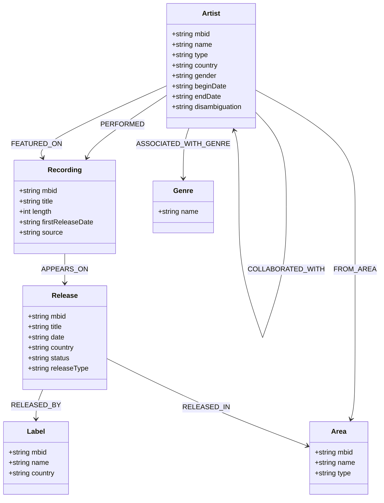

# Modèle de Données et Choix Techniques

Ce document décrit le modèle de données Neo4j de l'application **MusicGraph**, ainsi que les justifications d'architecture pour le choix de cette modélisation.

## Justification du choix de Neo4j (Base NoSQL orientée Graphe)

Dans l'industrie musicale, les données sont intrinsèquement connectées et multidimensionnelles :
- Les artistes collaborent de façon dynamique (features, duos, groupes).
- Un morceau (`Recording`) peut appartenir à plusieurs albums (`Release`).
- Les artistes appartiennent à plusieurs genres et pays.

Représenter ces relations dans une base relationnelle SQL classique (PostgreSQL, MySQL) nécessiterait de multiples tables de jointure (ex: `artist_recordings`, `recording_releases`, `artist_genres`) entraînant des requêtes complexes, des jointures coûteuses en ressources, et des performances en baisse à mesure que le volume de données augmente.

**Neo4j** offre les avantages suivants :
1. **Performance des jointures** : La navigation dans les relations (les arêtes) se fait en temps constant O(1) par saut de relation, indépendamment de la taille totale de la base.
2. **Requêtes intuitives avec Cypher** : Exprimer des chemins complexes ("Quels artistes lient Stromae à Jay-Z ?") s'écrit de manière claire et visuelle.
3. **Analyse de réseau** : Calculer les artistes les plus connectés (centralité de degré) ou les collaborations les plus fréquentes se fait de manière native et optimale.

---

## Modèle de Données Graph

### Nœuds

1. **Artist** : Représente un musicien, chanteur ou groupe musical.
   - Identifiant unique : `mbid` (MusicBrainz ID)
   - Attributs : `name`, `type` (Group/Person), `country`, `gender`, `beginDate`, `endDate`, `disambiguation`.

2. **Recording** : Représente une piste ou chanson enregistrée.
   - Identifiant unique : `mbid`
   - Attributs : `title`, `length` (en ms), `firstReleaseDate`, `source` (ex: "MusicBrainz").

3. **Release** : Représente un album, EP ou Single publié contenant des pistes.
   - Identifiant unique : `mbid`
   - Attributs : `title`, `date`, `country`, `status` (Official/Promotion), `releaseType` (Album/Single/EP).

4. **Label** : Représente une maison de disque ou label.
   - Identifiant unique : `mbid`
   - Attributs : `name`, `country`.

5. **Genre** : Catégorie ou style de musique.
   - Identifiant unique : `name` (en minuscules pour normalisation).

6. **Area** : Zone géographique ou pays d'origine de l'artiste ou de sortie de l'album.
   - Identifiant unique : `mbid`
   - Attributs : `name`, `type` (Country/City).

### Relations

- `(:Artist)-[:PERFORMED]->(:Recording)` : Indique que l'artiste est l'interprète principal du morceau.
- `(:Artist)-[:FEATURED_ON]->(:Recording)` : Indique que l'artiste est invité sur le morceau (featuring).
- `(:Artist)-[:COLLABORATED_WITH]->(:Artist)` : Relation symétrique stockant une collaboration directe établie sur au moins un morceau commun.
- `(:Recording)-[:APPEARS_ON]->(:Release)` : Indique la présence du morceau sur une édition physique ou numérique.
- `(:Release)-[:RELEASED_BY]->(:Label)` : Associe une publication à sa maison d'édition.
- `(:Artist)-[:ASSOCIATED_WITH_GENRE]->(:Genre)` : Associe un style de musique à un artiste.
- `(:Artist)-[:FROM_AREA]->(:Area)` : Associe l'artiste à sa région d'origine.
- `(:Release)-[:RELEASED_IN]->(:Area)` : Indique le territoire de distribution d'un album.
